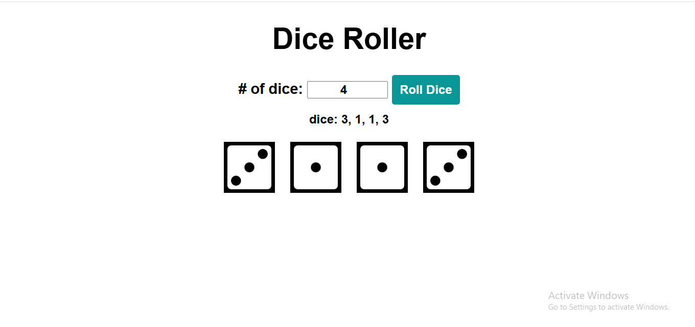

# Dice Roller Program

This is a simple Dice Roller program built with HTML, CSS, and JavaScript. It allows the user to roll a specified number of dice and displays the result both numerically and visually.

## 🌐 Live Demo

[View the live project here!](https://laibatariq110.github.io/Dice-Roller-Program)

## Table of Contents
- [Features](#features)
- [Setup](#setup)
- [Usage](#usage)
  
## Features
- Roll a specified number of dice.
- Display the result numerically.
- Display the result with images of dice.

## Setup
1. Clone the repository to your local machine.
2. Ensure you have the following file structure:
3. dice-roller/
├── images/
│ ├── 1.png
│ ├── 2.png
│ ├── 3.png
│ ├── 4.png
│ ├── 5.png
│ └── 6.png
├── index.html
├── styles.css
└── index.js

## Usage
1. Open `index.html` in your web browser.
2. Enter the number of dice you want to roll in the input box.
3. Click the "Roll Dice" button.
4. The result will be displayed below, both as text and as images of dice.

